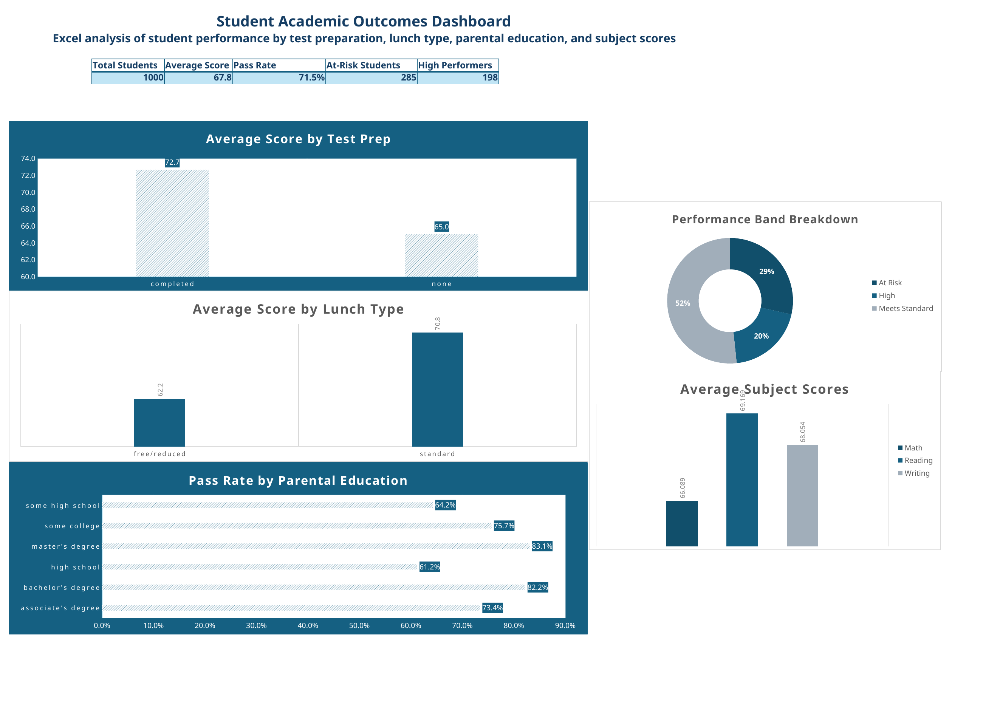

# Student Academic Outcomes Dashboard

I built this Excel dashboard to practice turning a flat CSV into something easier to explore. The dataset contains 1,000 student records with math, reading, and writing scores, along with information about lunch type, test preparation, and parental education.

The dashboard gives a quick view of overall performance, pass rates, high performers, and students who may need more support.



## Main results

| Measure | Result |
|---|---:|
| Students analyzed | 1,000 |
| Overall average score | 67.8 |
| Pass rate | 71.5% |
| At-risk students | 285 |
| High performers | 198 |

## What I noticed

Students who completed the test-preparation course averaged 72.7, compared with 65.0 for students who did not. That was a 7.7-point difference in this dataset.

Students receiving standard lunch averaged 70.8, while students receiving free or reduced lunch averaged 62.2.

Pass rates were highest among students whose parents held a master's degree or bachelor's degree. Reading had the highest subject average at 69.2, followed by writing at 68.1 and math at 66.1.

Using the performance bands I created, 28.5% of students were classified as At Risk, 51.7% as Meets Standard, and 19.8% as High.

These are patterns in this particular dataset. They should not be treated as proof that any one factor caused the score differences.

## How I set up the workbook

The file has four worksheets:

| Worksheet | What it contains |
|---|---|
| `StudentsPerformance` | The source data, converted to an Excel table, with added calculation columns |
| `Analysis` | PivotTables used to summarize the data |
| `Dashboard` | KPI cards and five charts |
| `README` | Notes and field definitions inside the workbook |

I added several helper fields to make the dashboard easier to build:

- **Average Score:** average of math, reading, and writing
- **Pass Flag:** `1` when the average score is at least 60
- **Outcome:** `Pass` or `At Risk`
- **Performance Band:** `High` for 80+, `Meets Standard` for 60 to 79.9, and `At Risk` below 60
- **Score Gap:** difference between a student's highest and lowest subject score

The 60-point pass cutoff and the performance bands are choices I made for this project. They are not official standards from the source dataset.

## What I used

- Microsoft Excel
- Excel Tables and structured-reference formulas
- PivotTables and PivotCharts
- KPI cards
- Data validation and calculated fields
- Dashboard layout and formatting

## Repository

```text
.
├── Student_Academic_Outcomes_Dashboard.xlsx
├── images/
│   └── dashboard-preview.png
└── README.md
```

Download `Student_Academic_Outcomes_Dashboard.xlsx` and open it in Microsoft
Excel. Start on the `Dashboard` sheet, then use the `Analysis` and
`StudentsPerformance` sheets to see how the results were built.

## About the data

The source is Kaggle's [Students Performance in Exams](https://www.kaggle.com/datasets/spscientist/students-performance-in-exams) dataset. The original ZIP can be [downloaded directly from Kaggle](https://www.kaggle.com/api/v1/datasets/download/spscientist/students-performance-in-exams).

It includes gender, race or ethnicity, parental education, lunch type, test-preparation status, and scores for math, reading, and writing. There are no student names or other direct identifiers in the file.

Kaggle currently lists the license as unknown. The original CSV is not included
as a separate file in this repository; use the Kaggle links above to download
the original package.

## Checks I made

I confirmed that the workbook contains all 1,000 records, four worksheets, three Excel tables, and five dashboard charts. I also checked the worksheet files for common formula errors such as `#REF!`, `#DIV/0!`, `#VALUE!`, `#NAME?`, and `#N/A`, and did not find any.
